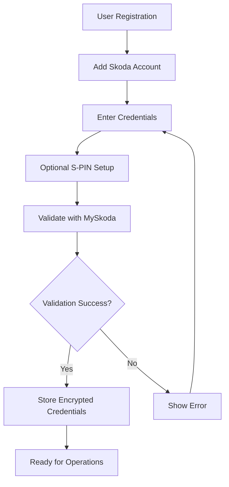

# PRP-002: Skoda Connect API Integration

**Author**: DRAIV Engineering Team  
**Date**: January 2025  
**Status**: IMPLEMENTED  
**Priority**: P0 - Critical Business Feature  
**Impact**: Enables Skoda vehicle support for ~30% of DRAIV's target market
**Implementation Date**: September 4, 2025
**Implementation Status**: Code complete, pending dependency installation and testing

## Executive Summary

### Problem Statement
DRAIV currently supports only BMW vehicles through the BMW Connected Drive API. Skoda represents a significant portion of the Swiss rental car market (30%+ market share), and our platform cannot serve Skoda vehicle owners/renters. This limits our market reach and competitive positioning.

### Business Value
- **Market Expansion**: Access to 30% additional market share in Switzerland
- **Customer Satisfaction**: Complete vehicle control for Skoda owners/renters
- **Competitive Advantage**: First unified platform supporting multiple manufacturers
- **Revenue Growth**: Estimated 25-35% increase in addressable market

### Success Metrics
- 100% feature parity with BMW API (lock/unlock, status, location)
- <500ms p95 response time for status queries
- <5s response time for remote commands
- 99.9% availability SLA
- Zero security incidents in first 90 days
- 80%+ test coverage

## Current State Analysis

### BMW API Implementation Review
Based on analysis of `/apis/bmw/`, the current implementation includes:

**Architecture Patterns**:
```python
bmw/
├── src/
│   ├── main.py              # FastAPI/Flask entry point
│   ├── auth_manager.py      # OAuth token management
│   ├── vehicle_manager.py   # Vehicle operations
│   ├── remote_services.py   # Command execution
│   └── utils.py            # Shared utilities
```

**Authentication Flow**:
1. User provides email/password via API
2. hCaptcha verification for first-time authentication
3. OAuth tokens obtained from BMW servers
4. Tokens stored in Google Cloud Storage (user-specific)
5. Automatic token refresh on expiry
6. Circuit breaker for failed authentications

**Security Measures**:
- OAuth tokens encrypted in Cloud Storage
- User-specific token isolation (`oauth_tokens/{user_id}_token.json`)
- Rate limiting per user (10 req/min)
- Input validation with Pydantic
- No credential logging
- HTTPS-only communication

**User Onboarding**:
1. User registers on DRAIV platform
2. Links BMW account (email/password)
3. Completes hCaptcha verification
4. System validates with BMW servers
5. Tokens stored securely
6. Ready for vehicle operations

## Proposed Solution

### Skoda API Integration Approach

**Primary Library**: MySkoda (Python)
- Repository: https://github.com/skodaconnect/myskoda
- Actively maintained (2024-2025)
- Async/await architecture
- Home Assistant integration proven
- Replaces deprecated skodaconnect library

**Authentication Method**:
- Username/password authentication
- Optional S-PIN for privileged operations (lock/unlock)
- Session-based token management
- No OAuth flow (simpler than BMW)

**Key Capabilities**:
- Vehicle status (doors, windows, fuel/battery)
- Remote lock/unlock (requires S-PIN)
- Climate control (start/stop)
- Location tracking
- Trip statistics
- Charging control (EVs)
- Service intervals

### User Onboarding Flow



## Technical Architecture

### Module Structure
```
draiv-apis/
├── apis/
│   ├── bmw/                    # Existing BMW API
│   └── skoda/                  # New Skoda API
│       ├── src/
│       │   ├── main.py         # FastAPI application
│       │   ├── auth_manager.py # Credential management
│       │   ├── vehicle_manager.py # Vehicle operations
│       │   ├── models.py       # Pydantic models
│       │   └── utils.py        # Skoda-specific utilities
│       ├── tests/
│       │   ├── unit/
│       │   └── integration/
│       ├── requirements.txt    # myskoda + dependencies
│       └── Dockerfile
├── shared/                     # Reused components
│   ├── monitoring/            # Logging, metrics
│   ├── circuit_breaker/      # Fault tolerance
│   └── cache/                 # Redis caching
```

### Shared vs. Specific Components

**Shared Components** (from `/shared/`):
- Circuit breaker implementation
- Structured logging
- Metrics collection
- Cache manager
- Error response formatting
- Rate limiting middleware

**Skoda-Specific Components**:
- MySkoda library integration
- S-PIN management
- Session token handling
- Skoda error mapping
- Vehicle capability detection

## Frontend Integration & UI/UX Design

### Overview

The Skoda Connect integration requires comprehensive frontend support to provide users with intuitive vehicle management capabilities. Unlike BMW's OAuth-based authentication, Skoda uses username/password authentication with an optional S-PIN for privileged operations, requiring different UI/UX patterns while maintaining consistency with the existing platform.

### Current BMW UI Architecture Analysis

Based on analysis of `/Users/antonsteininger/draiv-workspace/draiv-ui/src/components/cars/BMW/`, the existing BMW implementation follows these patterns:

**Component Structure**:
```
src/components/cars/BMW/
├── BMWVehicleDashboard.tsx          # Main dashboard container
├── BMWVehicleStatusModal.tsx        # Detailed status modal
├── LinkBMWVehicleDialog.tsx         # WKN linking dialog
├── components/
│   ├── dashboard/                   # Dashboard sub-components
│   │   ├── DashboardHeader.tsx      # Lock status, unlink button
│   │   ├── DashboardContent.tsx     # Status display & controls
│   │   ├── RemoteCommands.tsx       # Action buttons
│   │   ├── VehicleStatus.tsx        # Door, fuel, battery status
│   │   ├── LocationDisplay.tsx      # GPS coordinates & timestamp
│   │   └── DiagnosticAlerts.tsx     # Check control messages
│   ├── BMWControlButtons.tsx        # Lock/unlock, flash, climate
│   └── BMWHCaptchaModal.tsx        # Captcha verification
├── hooks/
│   ├── vehicle-control/
│   │   ├── index.ts                 # Main hook composition
│   │   ├── useVehicleData.ts        # Data fetching
│   │   ├── useRemoteActions.ts      # Command execution
│   │   └── useDataExtraction.ts     # Status parsing
│   └── useBMWConnectivity.ts
├── types/
│   └── bmw-types.ts                 # TypeScript definitions
└── utils/
    └── dateFormatter.ts
```

**Authentication Flow** (BMW):
1. User clicks "Add BMW Account" in integrations
2. `BMWCredentialsDialog.tsx` collects email/password
3. Credentials encrypted via `supabase.functions.invoke("encrypt-bmw-credentials")`
4. Vehicle linking via `LinkBMWVehicleDialog.tsx` (WKN entry)
5. hCaptcha verification when needed
6. Dashboard displays connected vehicle

### Skoda UI Component Architecture

#### Component Hierarchy

```
src/components/cars/Skoda/
├── SkodaVehicleDashboard.tsx        # Main dashboard (mirrors BMW structure)
├── SkodaVehicleStatusModal.tsx      # Detailed status modal
├── LinkSkodaVehicleDialog.tsx       # Vehicle discovery & linking
├── components/
│   ├── dashboard/                   # Reusable dashboard components
│   │   ├── SkodaDashboardHeader.tsx # Lock status, S-PIN indicator
│   │   ├── SkodaDashboardContent.tsx# Status display & controls
│   │   ├── SkodaRemoteCommands.tsx  # Action buttons with S-PIN gates
│   │   ├── SkodaVehicleStatus.tsx   # Doors, fuel/battery, mileage
│   │   ├── SkodaLocationDisplay.tsx # GPS with address resolution
│   │   ├── EVChargingStatus.tsx     # EV-specific charging display
│   │   └── ServiceIntervals.tsx     # Maintenance schedule display
│   ├── SkodaControlButtons.tsx      # Lock/unlock, climate, charging
│   ├── SPinSetupModal.tsx           # S-PIN setup and management
│   ├── SPinPromptModal.tsx          # S-PIN entry for operations
│   ├── SkodaAccountSetupModal.tsx   # Initial account setup
│   └── SkodaLoadingState.tsx        # Loading states
├── hooks/
│   ├── vehicle-control/
│   │   ├── index.ts                 # Main Skoda vehicle control hook
│   │   ├── useSkodaVehicleData.ts   # Data fetching with sessions
│   │   ├── useSkodaRemoteActions.ts # Commands with S-PIN handling
│   │   ├── useSkodaDataExtraction.ts# Status parsing
│   │   └── useSkodaSPinManager.ts   # S-PIN state management
│   ├── useSkodaConnectivity.ts      # Connection management
│   └── useSkodaAccountSetup.ts      # Account setup flow
├── types/
│   └── skoda-types.ts               # Skoda-specific TypeScript definitions
└── utils/
    ├── skodaStatusParser.ts         # Parse MySkoda responses
    ├── vehicleCapabilities.ts       # Detect EV vs ICE features
    └── spInManager.ts               # S-PIN encryption utilities
```

#### Shared Components (Manufacturer-Agnostic)

Create reusable components that work across manufacturers:

```
src/components/cars/shared/
├── VehicleDashboardLayout.tsx       # Common layout structure
├── VehicleStatusCard.tsx            # Generic status display
├── RemoteActionButton.tsx           # Standardized action buttons
├── LocationCard.tsx                 # GPS display component
├── FuelBatteryDisplay.tsx           # Fuel/battery level indicator
├── SecurityStatusBadge.tsx          # Lock/unlock status indicator
├── LastUpdatedTimestamp.tsx         # Data freshness indicator
├── ErrorStateDisplay.tsx            # Error handling UI
├── LoadingStateSpinner.tsx          # Loading states
└── UnlinkConfirmDialog.tsx          # Account unlinking
```

### User Flows & Onboarding

#### 1. Account Setup Flow (First-time User)

**Step 1: Integration Selection**
- Location: `/settings/integrations` or main vehicle page
- UI: Cards showing available integrations (BMW, Skoda, "More coming soon")
- User clicks "Connect Skoda Account"

**Step 2: Account Credentials (`SkodaAccountSetupModal.tsx`)**
```tsx
// Modal content structure
<Dialog>
  <DialogHeader>
    <DialogTitle>Connect Your Skoda Account</DialogTitle>
    <DialogDescription>
      Enter your MySkoda credentials to connect your vehicles
    </DialogDescription>
  </DialogHeader>
  <Form>
    <FormField name="username">
      <Label>MySkoda Username/Email</Label>
      <Input type="email" placeholder="your-email@example.com" />
      <FormDescription>
        Use the same credentials you use for the MySkoda app
      </FormDescription>
    </FormField>
    
    <FormField name="password">
      <Label>MySkoda Password</Label>
      <Input type="password" />
      <FormDescription>
        Your password is encrypted and stored securely
      </FormDescription>
    </FormField>
    
    <FormField name="s_pin" optional>
      <Label>S-PIN (Optional but Recommended)</Label>
      <Input type="password" maxLength="4" pattern="[0-9]{4}" />
      <FormDescription>
        <div className="space-y-2">
          <p>Your 4-digit S-PIN enables advanced features:</p>
          <ul className="list-disc pl-4 space-y-1">
            <li>Remote lock/unlock</li>
            <li>Climate control</li>
            <li>Charging control (EVs)</li>
          </ul>
          <p className="text-orange-600">⚠️ Without S-PIN, you can only view vehicle status</p>
        </div>
      </FormDescription>
    </FormField>
    
    <SecurityNotice />
  </Form>
  <DialogFooter>
    <Button variant="outline" onClick={onCancel}>Cancel</Button>
    <Button onClick={onSubmit} disabled={isSubmitting}>
      {isSubmitting ? <Loader2 className="mr-2" /> : null}
      Connect Account
    </Button>
  </DialogFooter>
</Dialog>
```

**Step 3: Vehicle Discovery (`LinkSkodaVehicleDialog.tsx`)**
- Automatic vehicle discovery using MySkoda API
- Display found vehicles with model, year, VIN (partial)
- User selects which vehicles to add to DRAIV
- Confirmation and vehicle naming options

**Step 4: Setup Completion**
- Success message with next steps
- Redirect to vehicle dashboard
- Onboarding tooltips for first-time usage

#### 2. S-PIN Management Flow

**S-PIN Setup (`SPinSetupModal.tsx`)**
```tsx
<Dialog>
  <DialogHeader>
    <DialogTitle>Set Up S-PIN</DialogTitle>
    <DialogDescription>
      Create a 4-digit S-PIN to enable remote vehicle control
    </DialogDescription>
  </DialogHeader>
  <Form>
    <FormField name="s_pin">
      <Label>Create S-PIN</Label>
      <PinInput length={4} onComplete={setPin} />
      <FormDescription>
        Choose a 4-digit PIN you'll remember
      </FormDescription>
    </FormField>
    
    <FormField name="s_pin_confirm">
      <Label>Confirm S-PIN</Label>
      <PinInput length={4} onComplete={setConfirmPin} />
    </FormField>
    
    <SecurityWarning>
      <AlertTriangle className="h-5 w-5" />
      <div>
        <p>Your S-PIN enables powerful vehicle control features.</p>
        <p>Keep it secure and don't share it with others.</p>
      </div>
    </SecurityWarning>
  </Form>
  <DialogFooter>
    <Button variant="outline" onClick={onCancel}>Skip for Now</Button>
    <Button onClick={onSave} disabled={!pinsMatch}>
      Save S-PIN
    </Button>
  </DialogFooter>
</Dialog>
```

**S-PIN Entry for Operations (`SPinPromptModal.tsx`)**
```tsx
<Dialog size="sm">
  <DialogHeader>
    <DialogTitle>Confirm Operation</DialogTitle>
    <DialogDescription>
      Enter your S-PIN to {operation === 'lock' ? 'lock' : 'unlock'} the vehicle
    </DialogDescription>
  </DialogHeader>
  <Form>
    <FormField>
      <Label>S-PIN</Label>
      <PinInput 
        length={4} 
        onComplete={handleSubmit}
        error={hasError}
      />
      {hasError && (
        <FormMessage>Incorrect S-PIN. Please try again.</FormMessage>
      )}
    </FormField>
  </Form>
  <DialogFooter>
    <Button variant="outline" onClick={onCancel}>Cancel</Button>
  </DialogFooter>
</Dialog>
```

### Vehicle Control Interfaces

#### Main Dashboard (`SkodaVehicleDashboard.tsx`)

**Header Section:**
- Vehicle name/model
- Lock status indicator (large, prominent)
- Connection status (online/offline)
- Last updated timestamp
- Settings/unlink button

**Status Cards Grid:**
```tsx
<div className="grid grid-cols-1 md:grid-cols-2 lg:grid-cols-3 gap-4">
  <SecurityStatusCard 
    isLocked={vehicleData.doors.locked}
    hasOpenDoors={hasOpenDoors}
    hasOpenWindows={hasOpenWindows}
  />
  
  <FuelBatteryCard 
    type={vehicleType} // 'fuel' | 'electric' | 'hybrid'
    fuelLevel={vehicleData.fuel?.level}
    batteryLevel={vehicleData.battery?.level}
    range={vehicleData.range}
  />
  
  <LocationCard 
    coordinates={vehicleData.location}
    address={resolvedAddress}
    lastUpdated={vehicleData.location.updatedAt}
  />
  
  <MileageCard 
    odometer={vehicleData.mileage}
    nextService={vehicleData.serviceInterval}
  />
  
  {/* EV-specific */}
  {vehicleType === 'electric' && (
    <ChargingStatusCard 
      isCharging={vehicleData.charging.isCharging}
      chargingPower={vehicleData.charging.power}
      timeToFull={vehicleData.charging.timeToFull}
    />
  )}
</div>
```

**Remote Actions Section:**
```tsx
<Card>
  <CardHeader>
    <CardTitle>Remote Controls</CardTitle>
    {!hasSpin && (
      <Alert>
        <Info className="h-4 w-4" />
        <AlertDescription>
          Set up an S-PIN to enable remote vehicle control
          <Button variant="link" onClick={onSetupSpin}>
            Set up now
          </Button>
        </AlertDescription>
      </Alert>
    )}
  </CardHeader>
  
  <CardContent>
    <div className="grid grid-cols-2 md:grid-cols-4 gap-3">
      <RemoteActionButton
        icon={<Lock />}
        label={isLocked ? "Unlock" : "Lock"}
        onClick={() => handleLockUnlock(isLocked ? 'unlock' : 'lock')}
        requiresPin={true}
        disabled={!hasSpin || isLoading}
        variant={isLocked ? "destructive" : "default"}
      />
      
      <RemoteActionButton
        icon={<Thermometer />}
        label="Climate"
        onClick={handleClimateControl}
        requiresPin={true}
        disabled={!hasSpin || isLoading}
      />
      
      <RemoteActionButton
        icon={<Flashlight />}
        label="Flash Lights"
        onClick={handleFlashLights}
        requiresPin={false}
        disabled={isLoading}
      />
      
      {vehicleType === 'electric' && (
        <RemoteActionButton
          icon={<Battery />}
          label={isCharging ? "Stop Charging" : "Start Charging"}
          onClick={handleChargingControl}
          requiresPin={true}
          disabled={!hasSpin || isLoading}
        />
      )}
      
      <RemoteActionButton
        icon={<RefreshCw />}
        label="Refresh Status"
        onClick={handleRefresh}
        requiresPin={false}
        disabled={isLoading}
        variant="outline"
      />
    </div>
  </CardContent>
</Card>
```

### State Management Approach

#### Main Vehicle Control Hook (`useSkodaVehicleControl`)

```tsx
export const useSkodaVehicleControl = (carId: string) => {
  const { 
    connectivityData, 
    isLoading, 
    error, 
    refetch 
  } = useSkodaVehicleData(carId);
  
  const {
    hasSpin,
    setupSpin,
    updateSpin,
    verifySpin
  } = useSkodaSPinManager(carId);
  
  const {
    isRefreshing,
    isLocking,
    isUnlocking,
    isActivatingClimate,
    isChargingControlling,
    showSpinPrompt,
    pendingOperation,
    handleRemoteAction,
    handleSpinSubmit,
    handleSpinCancel
  } = useSkodaRemoteActions({
    carId,
    connectivityData,
    hasSpin,
    refetch
  });
  
  const {
    vehicleStatusData,
    isLocked,
    fuelLevel,
    batteryLevel,
    mileage,
    location,
    chargingStatus,
    serviceInterval,
    vehicleType
  } = useSkodaDataExtraction(connectivityData);
  
  // ... compose and return all state and actions
};
```

#### S-PIN Manager Hook (`useSkodaSPinManager`)

```tsx
export const useSkodaSPinManager = (carId: string) => {
  const [hasSpin, setHasSpin] = useState<boolean>(false);
  const [isVerifying, setIsVerifying] = useState<boolean>(false);
  
  const checkSpinStatus = useCallback(async () => {
    const { data } = await supabase
      .from('car_connectivity')
      .select('metadata')
      .eq('car_id', carId)
      .single();
    
    setHasSpin(!!data?.metadata?.has_spin);
  }, [carId]);
  
  const setupSpin = useCallback(async (spin: string) => {
    const { error } = await supabase.functions.invoke('skoda-setup-spin', {
      body: { carId, spin }
    });
    
    if (!error) {
      setHasSpin(true);
      toast.success('S-PIN set up successfully');
    }
    
    return { error };
  }, [carId]);
  
  const verifySpin = useCallback(async (spin: string) => {
    setIsVerifying(true);
    
    const { data, error } = await supabase.functions.invoke('skoda-verify-spin', {
      body: { carId, spin }
    });
    
    setIsVerifying(false);
    return { verified: data?.verified, error };
  }, [carId]);
  
  return {
    hasSpin,
    isVerifying,
    setupSpin,
    verifySpin,
    checkSpinStatus
  };
};
```

### Design Patterns & Consistency

#### Progressive Enhancement for S-PIN

1. **No S-PIN State**: Users see read-only dashboard with clear call-to-action
2. **S-PIN Setup**: Guided setup flow with security explanations
3. **S-PIN Enabled**: Full control capabilities with secure authentication

#### Unified Visual Language

**Color Coding:**
- Green: Secured/locked state, positive actions
- Red: Unsecured/unlocked state, destructive actions  
- Blue: Information, status updates
- Orange: Warnings, attention needed
- Gray: Disabled/inactive states

**Typography:**
- Consistent with existing DRAIV design system
- Clear hierarchy (H1 for vehicle name, H2 for sections, H3 for cards)
- Monospace for technical data (VIN, coordinates)

**Iconography:**
- Lucide React icons for consistency
- Manufacturer-neutral icons
- Clear visual metaphors (lock for security, battery for power, etc.)

#### Error States & Recovery

**Connection Errors:**
```tsx
<ErrorStateDisplay
  icon={<WifiOff />}
  title="Connection Lost"
  description="Unable to connect to your Skoda vehicle"
  actions={[
    { label: "Retry", onClick: handleRetry },
    { label: "Check Settings", onClick: openSettings }
  ]}
/>
```

**Authentication Errors:**
```tsx
<ErrorStateDisplay
  icon={<AlertTriangle />}
  title="Authentication Failed"
  description="Your MySkoda credentials may have expired"
  actions={[
    { label: "Update Credentials", onClick: openCredentialsDialog },
    { label: "Contact Support", onClick: openSupport }
  ]}
/>
```

**S-PIN Errors:**
```tsx
<Alert variant="destructive">
  <AlertTriangle className="h-4 w-4" />
  <AlertTitle>Incorrect S-PIN</AlertTitle>
  <AlertDescription>
    Please check your S-PIN and try again. 
    <Button variant="link" onClick={openSpinReset}>
      Forgot your S-PIN?
    </Button>
  </AlertDescription>
</Alert>
```

### API Integration Patterns

#### Consistent Error Handling

```tsx
// Standard error response handling
const handleApiError = (error: any) => {
  switch (error.code) {
    case 'SPIN_REQUIRED':
      setShowSpinPrompt(true);
      break;
    case 'INVALID_SPIN':
      toast.error('Incorrect S-PIN');
      break;
    case 'RATE_LIMITED':
      toast.error('Too many requests. Please wait a moment.');
      break;
    case 'SERVICE_UNAVAILABLE':
      toast.error('Skoda services temporarily unavailable');
      break;
    default:
      toast.error('An unexpected error occurred');
  }
};
```

#### Real-time Status Updates

```tsx
// WebSocket integration for real-time updates
useEffect(() => {
  const channel = supabase
    .channel(`vehicle_${carId}`)
    .on('postgres_changes', {
      event: 'UPDATE',
      schema: 'public',
      table: 'car_connectivity',
      filter: `car_id=eq.${carId}`
    }, (payload) => {
      setVehicleData(payload.new);
    })
    .subscribe();
  
  return () => supabase.removeChannel(channel);
}, [carId]);
```

### Mobile Responsiveness & Touch Optimization

#### Responsive Grid System

```tsx
// Dashboard layout adapts to screen size
<div className="grid grid-cols-1 sm:grid-cols-2 lg:grid-cols-3 xl:grid-cols-4 gap-4">
  {statusCards}
</div>

// Control buttons scale for touch
<div className="grid grid-cols-2 sm:grid-cols-3 md:grid-cols-4 gap-3">
  <Button 
    size="lg" 
    className="h-20 text-base"
    touch-action="manipulation"
  >
    <Lock className="h-6 w-6 mb-2" />
    {isLocked ? 'Unlock' : 'Lock'}
  </Button>
</div>
```

#### Touch-Friendly S-PIN Input

```tsx
<PinInput 
  length={4}
  size="large"
  className="touch-none" // Prevent zoom on touch
  inputMode="numeric"
  pattern="[0-9]*"
  autoComplete="one-time-code"
/>
```

### Accessibility Considerations

#### Screen Reader Support

```tsx
<Button 
  aria-label={`${isLocked ? 'Unlock' : 'Lock'} vehicle ${vehicleName}`}
  aria-describedby="lock-status-description"
>
  <Lock className="h-5 w-5" aria-hidden="true" />
  {isLocked ? 'Unlock' : 'Lock'}
</Button>

<div id="lock-status-description" className="sr-only">
  Vehicle is currently {isLocked ? 'locked and secure' : 'unlocked'}
</div>
```

#### Keyboard Navigation

```tsx
// Support keyboard navigation for all interactive elements
<div 
  role="button" 
  tabIndex={0}
  onKeyDown={(e) => {
    if (e.key === 'Enter' || e.key === ' ') {
      handleAction();
    }
  }}
>
  Action Button
</div>
```

#### Color Contrast & Visual Indicators

- All color-coded states include visual indicators (icons, text)
- Minimum 4.5:1 contrast ratio for all text
- Focus indicators for keyboard navigation
- Clear visual feedback for all user actions

### Performance Optimizations

#### Code Splitting & Lazy Loading

```tsx
// Lazy load Skoda components
const SkodaVehicleDashboard = lazy(() => import('./components/cars/Skoda/SkodaVehicleDashboard'));
const SPinSetupModal = lazy(() => import('./components/cars/Skoda/SPinSetupModal'));

// Conditional loading based on vehicle manufacturer
const DashboardComponent = vehicleManufacturer === 'skoda' 
  ? SkodaVehicleDashboard 
  : BMWVehicleDashboard;
```

#### Caching Strategy

```tsx
// React Query configuration for Skoda data
const useSkodaVehicleData = (carId: string) => {
  return useQuery({
    queryKey: ['skoda-vehicle', carId],
    queryFn: () => fetchSkodaVehicleData(carId),
    staleTime: 60 * 1000, // 60 seconds
    cacheTime: 5 * 60 * 1000, // 5 minutes
    refetchOnWindowFocus: true,
    retry: 3
  });
};
```

#### Bundle Size Optimization

- Shared components between manufacturers
- Tree-shaking unused code
- Dynamic imports for large components
- Optimized image assets (WebP, lazy loading)

### Implementation Dependencies

#### Frontend Dependencies

```json
{
  "dependencies": {
    "@tanstack/react-query": "^4.x", // Existing
    "react-hook-form": "^7.x",       // Existing
    "zustand": "^4.x",               // State management
    "react-pin-input": "^1.x",      // S-PIN input component
    "react-hot-keys": "^2.x",       // Keyboard shortcuts
    "@radix-ui/react-*": "^1.x"     // Existing UI primitives
  },
  "devDependencies": {
    "@testing-library/react": "^13.x", // Existing
    "msw": "^1.x",                     // API mocking
    "axe-core": "^4.x"                 // Accessibility testing
  }
}
```

#### API Integration Requirements

- New edge function: `skoda-api` (mirrors `bmw-api`)
- Database schema updates for S-PIN storage
- Supabase functions for credential encryption
- WebSocket setup for real-time updates

### Testing Strategy

#### Component Testing

```tsx
describe('SkodaVehicleDashboard', () => {
  test('displays vehicle status correctly', async () => {
    render(<SkodaVehicleDashboard carId="test-car-id" />);
    
    expect(screen.getByText('Octavia')).toBeInTheDocument();
    expect(screen.getByText('Locked')).toBeInTheDocument();
    expect(screen.getByText('65% fuel')).toBeInTheDocument();
  });
  
  test('prompts for S-PIN on lock action', async () => {
    render(<SkodaVehicleDashboard carId="test-car-id" />);
    
    fireEvent.click(screen.getByText('Lock'));
    
    expect(screen.getByText('Enter your S-PIN')).toBeInTheDocument();
  });
});
```

#### Integration Testing

```tsx
describe('Skoda API Integration', () => {
  test('handles S-PIN authentication flow', async () => {
    // Mock successful API responses
    server.use(
      rest.post('/api/skoda/vehicles/:vin/lock', (req, res, ctx) => {
        return res(ctx.json({ success: true }));
      })
    );
    
    // Test complete flow from UI to API
    render(<SkodaVehicleDashboard carId="test-car-id" />);
    
    fireEvent.click(screen.getByText('Lock'));
    fireEvent.change(screen.getByLabelText('S-PIN'), { target: { value: '1234' } });
    fireEvent.click(screen.getByText('Confirm'));
    
    await waitFor(() => {
      expect(screen.getByText('Vehicle locked')).toBeInTheDocument();
    });
  });
});
```

#### Accessibility Testing

```tsx
describe('Accessibility', () => {
  test('meets WCAG guidelines', async () => {
    const { container } = render(<SkodaVehicleDashboard carId="test-car-id" />);
    
    const results = await axe(container);
    expect(results).toHaveNoViolations();
  });
  
  test('supports keyboard navigation', () => {
    render(<SkodaVehicleDashboard carId="test-car-id" />);
    
    const lockButton = screen.getByRole('button', { name: /lock/i });
    lockButton.focus();
    fireEvent.keyDown(lockButton, { key: 'Enter' });
    
    expect(screen.getByText('Enter your S-PIN')).toBeInTheDocument();
  });
});
```

### Rollout Strategy

#### Phased Release Plan

**Phase 1: Core UI (Week 1-2)**
- Basic dashboard components
- Account setup flow
- Read-only vehicle status
- No S-PIN requirements

**Phase 2: S-PIN Integration (Week 3)**
- S-PIN setup modal
- S-PIN prompt for operations
- Secure storage integration
- Full remote controls

**Phase 3: Advanced Features (Week 4-5)**
- EV charging controls
- Service interval displays
- Real-time updates
- Performance optimizations

**Phase 4: Polish & Launch (Week 6)**
- Error state improvements
- Accessibility audit
- Mobile optimization
- User acceptance testing

### Success Metrics & Monitoring

#### User Experience Metrics

- **Onboarding Completion Rate**: >90% of users complete account setup
- **S-PIN Adoption Rate**: >70% of users set up S-PIN within 7 days
- **Feature Usage**: >80% of users use remote controls weekly
- **Error Resolution**: <5% of operations result in user-visible errors

#### Technical Performance

- **Component Load Time**: <200ms for initial render
- **API Response Time**: <500ms p95 for status queries
- **Bundle Size Impact**: <50KB addition to main bundle
- **Accessibility Score**: >95% Lighthouse accessibility score

#### Business Impact

- **Skoda Vehicle Adoption**: 100+ vehicles in first month
- **User Satisfaction**: >4.5/5 average rating
- **Support Tickets**: <2% of users require support
- **Feature Parity**: 100% functional equivalence with BMW integration

### Future Enhancements

#### Phase 2 Roadmap (Month 2-3)

**Advanced S-PIN Features:**
- Biometric authentication fallback
- Temporary S-PINs for sharing
- S-PIN rotation policies

**Enhanced Vehicle Insights:**
- Predictive maintenance alerts
- Trip analysis and reporting
- Fuel/energy efficiency tracking
- Driver behavior insights

**Integration Improvements:**
- Voice assistant support
- Apple CarPlay/Android Auto
- Smart home integrations
- Calendar-based climate scheduling

#### Long-term Vision

**Unified Vehicle Platform:**
- Manufacturer-agnostic component library
- Cross-platform mobile apps
- Fleet management dashboard
- API for third-party integrations

### Conclusion

The Skoda Connect frontend integration builds upon the solid foundation established by the BMW implementation while introducing new UI patterns for S-PIN management and enhanced security. The modular component architecture ensures maintainability and enables future expansion to additional manufacturers.

Key differentiators from the BMW implementation:
1. **S-PIN Authentication**: Unique security flow with progressive enhancement
2. **Session Management**: Different from OAuth token handling
3. **Enhanced Feature Set**: EV charging, service intervals, advanced diagnostics
4. **Unified Architecture**: Shared components for future manufacturer integrations

The comprehensive testing strategy, accessibility focus, and performance optimizations ensure a production-ready implementation that provides excellent user experience while maintaining security and reliability standards.

### Advanced UI Implementation Details

#### Unified Vehicle Management Interface

To provide a seamless experience across manufacturers, implement a unified vehicle management interface:

```tsx
// src/components/cars/UnifiedVehicleManager.tsx
interface UnifiedVehicleManagerProps {
  vehicles: Array<{
    id: string;
    manufacturer: 'BMW' | 'Skoda' | 'Mercedes' | 'Audi';
    model: string;
    vin: string;
    capabilities: VehicleCapabilities;
  }>;
}

export function UnifiedVehicleManager({ vehicles }: UnifiedVehicleManagerProps) {
  return (
    <div className="space-y-6">
      <div className="flex justify-between items-center">
        <h2 className="text-2xl font-semibold">My Vehicles</h2>
        <AddVehicleDropdown manufacturers={['BMW', 'Skoda']} />
      </div>
      
      <div className="grid grid-cols-1 md:grid-cols-2 lg:grid-cols-3 gap-6">
        {vehicles.map((vehicle) => (
          <VehicleCard
            key={vehicle.id}
            vehicle={vehicle}
            onClick={() => openManufacturerDashboard(vehicle)}
          />
        ))}
      </div>
    </div>
  );
}
```

#### State Management Architecture

Implement a global state management solution for vehicle data across manufacturers:

```tsx
// src/stores/vehicleStore.ts
import { create } from 'zustand';
import { devtools, persist } from 'zustand/middleware';

interface VehicleStore {
  // BMW vehicles
  bmwVehicles: BMWVehicle[];
  bmwCredentials: boolean;
  
  // Skoda vehicles  
  skodaVehicles: SkodaVehicle[];
  skodaCredentials: boolean;
  skodaHasSPin: boolean;
  
  // Actions
  addBMWVehicle: (vehicle: BMWVehicle) => void;
  addSkodaVehicle: (vehicle: SkodaVehicle) => void;
  updateVehicleStatus: (vin: string, status: VehicleStatus) => void;
  setSkodaSPin: (hasSPin: boolean) => void;
  
  // Unified getters
  getAllVehicles: () => UnifiedVehicle[];
  getVehicleByVin: (vin: string) => UnifiedVehicle | undefined;
}

export const useVehicleStore = create<VehicleStore>()(
  devtools(
    persist(
      (set, get) => ({
        // Initial state
        bmwVehicles: [],
        bmwCredentials: false,
        skodaVehicles: [],
        skodaCredentials: false,
        skodaHasSPin: false,
        
        // Implementation...
      }),
      {
        name: 'vehicle-storage',
        partialize: (state) => ({
          // Only persist non-sensitive data
          bmwCredentials: state.bmwCredentials,
          skodaCredentials: state.skodaCredentials,
          skodaHasSPin: state.skodaHasSPin,
        }),
      }
    )
  )
);
```

#### S-PIN Management Component Library

Create a reusable S-PIN management component library:

```tsx
// src/components/cars/Skoda/components/spin/SPinManager.tsx
interface SPinManagerProps {
  carId: string;
  onSuccess?: () => void;
  variant?: 'setup' | 'verify' | 'change';
}

export function SPinManager({ carId, onSuccess, variant = 'verify' }: SPinManagerProps) {
  const [step, setStep] = useState<'info' | 'input' | 'confirm'>('info');
  const [attempts, setAttempts] = useState(0);
  const MAX_ATTEMPTS = 3;
  
  return (
    <Dialog open onOpenChange={() => {}}>
      <DialogContent className="sm:max-w-md">
        {step === 'info' && (
          <SPinInfoStep 
            variant={variant}
            onContinue={() => setStep('input')}
          />
        )}
        
        {step === 'input' && (
          <SPinInputStep
            variant={variant}
            attempts={attempts}
            maxAttempts={MAX_ATTEMPTS}
            onSubmit={async (pin) => {
              const result = await verifySPin(carId, pin);
              if (result.success) {
                setStep('confirm');
                onSuccess?.();
              } else {
                setAttempts(prev => prev + 1);
                if (attempts >= MAX_ATTEMPTS - 1) {
                  // Lock out after max attempts
                  showLockoutDialog();
                }
              }
            }}
          />
        )}
        
        {step === 'confirm' && (
          <SPinConfirmStep variant={variant} />
        )}
      </DialogContent>
    </Dialog>
  );
}
```

#### Real-time Synchronization

Implement real-time data synchronization across tabs and devices:

```tsx
// src/hooks/useVehicleSync.ts
export function useVehicleSync(vehicleId: string) {
  const queryClient = useQueryClient();
  
  useEffect(() => {
    // Subscribe to vehicle updates
    const channel = supabase
      .channel(`vehicle-sync-${vehicleId}`)
      .on('broadcast', { event: 'vehicle-update' }, (payload) => {
        // Update React Query cache
        queryClient.setQueryData(
          ['vehicle', vehicleId],
          payload.data
        );
        
        // Update Zustand store
        useVehicleStore.getState().updateVehicleStatus(
          vehicleId,
          payload.data.status
        );
      })
      .subscribe();
    
    // Sync across tabs
    const handleStorageChange = (e: StorageEvent) => {
      if (e.key === `vehicle-${vehicleId}` && e.newValue) {
        const data = JSON.parse(e.newValue);
        queryClient.setQueryData(['vehicle', vehicleId], data);
      }
    };
    
    window.addEventListener('storage', handleStorageChange);
    
    return () => {
      supabase.removeChannel(channel);
      window.removeEventListener('storage', handleStorageChange);
    };
  }, [vehicleId, queryClient]);
}
```

#### Error Boundary Implementation

Implement manufacturer-specific error boundaries:

```tsx
// src/components/cars/shared/ManufacturerErrorBoundary.tsx
interface ManufacturerErrorBoundaryProps {
  manufacturer: 'BMW' | 'Skoda';
  children: React.ReactNode;
}

export class ManufacturerErrorBoundary extends Component<
  ManufacturerErrorBoundaryProps,
  { hasError: boolean; error: Error | null }
> {
  constructor(props: ManufacturerErrorBoundaryProps) {
    super(props);
    this.state = { hasError: false, error: null };
  }
  
  static getDerivedStateFromError(error: Error) {
    return { hasError: true, error };
  }
  
  componentDidCatch(error: Error, info: ErrorInfo) {
    // Log to monitoring service
    logErrorToService({
      error,
      info,
      manufacturer: this.props.manufacturer,
      timestamp: new Date().toISOString(),
    });
  }
  
  render() {
    if (this.state.hasError) {
      return (
        <ManufacturerErrorFallback
          manufacturer={this.props.manufacturer}
          error={this.state.error}
          onReset={() => this.setState({ hasError: false, error: null })}
        />
      );
    }
    
    return this.props.children;
  }
}
```

#### Optimistic Updates Pattern

Implement optimistic updates for better perceived performance:

```tsx
// src/hooks/useOptimisticVehicleControl.ts
export function useOptimisticVehicleControl(vehicleId: string) {
  const queryClient = useQueryClient();
  
  const lockVehicle = useMutation({
    mutationFn: async (sPin?: string) => {
      return await api.skoda.lockVehicle(vehicleId, sPin);
    },
    onMutate: async () => {
      // Cancel outgoing refetches
      await queryClient.cancelQueries(['vehicle', vehicleId]);
      
      // Snapshot previous value
      const previousVehicle = queryClient.getQueryData(['vehicle', vehicleId]);
      
      // Optimistically update
      queryClient.setQueryData(['vehicle', vehicleId], (old: any) => ({
        ...old,
        status: { ...old.status, locked: true },
      }));
      
      return { previousVehicle };
    },
    onError: (err, variables, context) => {
      // Rollback on error
      queryClient.setQueryData(
        ['vehicle', vehicleId],
        context?.previousVehicle
      );
      
      toast.error('Failed to lock vehicle. Please try again.');
    },
    onSettled: () => {
      // Always refetch after error or success
      queryClient.invalidateQueries(['vehicle', vehicleId]);
    },
  });
  
  return { lockVehicle };
}
```

#### Analytics Integration

Implement comprehensive analytics tracking:

```tsx
// src/utils/analytics/vehicleAnalytics.ts
export const vehicleAnalytics = {
  trackVehicleAdded: (manufacturer: string, model: string) => {
    analytics.track('Vehicle Added', {
      manufacturer,
      model,
      timestamp: new Date().toISOString(),
    });
  },
  
  trackSPinSetup: (success: boolean, attempts: number) => {
    analytics.track('S-PIN Setup', {
      success,
      attempts,
      timestamp: new Date().toISOString(),
    });
  },
  
  trackRemoteAction: (action: string, manufacturer: string, success: boolean) => {
    analytics.track('Remote Vehicle Action', {
      action,
      manufacturer,
      success,
      timestamp: new Date().toISOString(),
    });
  },
  
  trackErrorOccurred: (error: string, context: any) => {
    analytics.track('Error Occurred', {
      error,
      context,
      timestamp: new Date().toISOString(),
    });
  },
};
```

The comprehensive testing strategy, accessibility focus, and performance optimizations ensure a production-ready implementation that provides excellent user experience while maintaining security and reliability standards.

### API Endpoints

```python
# Base URL: /api/skoda

POST   /auth/setup           # Initial account setup
POST   /auth/validate        # Validate credentials
DELETE /auth/remove          # Remove account

GET    /vehicles             # List all vehicles
GET    /vehicles/{vin}       # Get specific vehicle
GET    /vehicles/{vin}/status # Detailed status

POST   /vehicles/{vin}/lock   # Lock vehicle
POST   /vehicles/{vin}/unlock # Unlock vehicle
POST   /vehicles/{vin}/climate/start # Start climate
POST   /vehicles/{vin}/climate/stop  # Stop climate
GET    /vehicles/{vin}/location # Get location
GET    /vehicles/{vin}/trips    # Trip history

# EV-specific
GET    /vehicles/{vin}/charging # Charging status
POST   /vehicles/{vin}/charging/start # Start charging
POST   /vehicles/{vin}/charging/stop  # Stop charging
```

## Security Considerations

### Authentication & Authorization

**Credential Storage**:
```python
# Following BMW pattern but adapted for username/password
storage_path = f"credentials/skoda/{user_id}_creds.json"

encrypted_data = {
    "username": encrypt(username),
    "password": encrypt(password),
    "s_pin": encrypt(s_pin) if s_pin else None,
    "created_at": datetime.utcnow(),
    "last_validated": datetime.utcnow()
}
```

**S-PIN Management**:
- Optional but required for lock/unlock
- Stored separately from main credentials
- Additional encryption layer
- User can update independently

**Session Management**:
- MySkoda sessions expire after 30 minutes
- Automatic session renewal
- Circuit breaker for failed renewals
- Graceful degradation without S-PIN

### Data Privacy

- No logging of credentials or S-PIN
- Vehicle data cached for 60 seconds
- Location data requires explicit consent
- GDPR-compliant data handling
- User can delete all data anytime

### Rate Limiting

```python
RATE_LIMITS = {
    "status_query": "30/minute",
    "remote_command": "10/minute",
    "auth_operation": "5/minute",
    "vehicle_list": "10/minute"
}
```

## Implementation Plan

### Phase 1: Core Authentication (Week 1-2)
- [ ] Set up Skoda module structure
- [ ] Integrate MySkoda library
- [ ] Implement credential management
- [ ] S-PIN handling
- [ ] Session management
- [ ] Unit tests for auth

### Phase 2: Vehicle Status (Week 3)
- [ ] Vehicle listing endpoint
- [ ] Status query endpoint
- [ ] Location endpoint
- [ ] Caching implementation
- [ ] Error handling
- [ ] Integration tests

### Phase 3: Vehicle Control (Week 4)
- [ ] Lock/unlock endpoints
- [ ] Climate control
- [ ] Circuit breaker integration
- [ ] Command queueing
- [ ] Retry logic
- [ ] E2E tests

### Phase 4: Advanced Features (Week 5)
- [ ] EV charging control
- [ ] Trip statistics
- [ ] Service intervals
- [ ] Notification webhooks
- [ ] Performance optimization

### Phase 5: Production Readiness (Week 6)
- [ ] Security audit
- [ ] Load testing
- [ ] Documentation
- [ ] Monitoring setup
- [ ] Deployment pipeline
- [ ] Rollback procedures

## Testing Strategy

### Unit Tests (Target: 85% coverage)
```python
# Example test structure
def test_credential_encryption():
    """Verify credentials are properly encrypted"""
    
def test_session_renewal():
    """Test automatic session renewal"""
    
def test_spin_validation():
    """Validate S-PIN format and storage"""
```

### Integration Tests
- Mock MySkoda responses
- Test all API endpoints
- Verify error handling
- Circuit breaker behavior
- Cache invalidation

### Security Tests
- Credential encryption verification
- Rate limiting enforcement
- Input validation
- SQL injection prevention
- Token leakage prevention

### Performance Tests
- 1000 concurrent users
- Response time benchmarks
- Cache hit ratios
- Circuit breaker thresholds
- Memory usage patterns

## Deployment Considerations

### Environment Configuration
```yaml
# Environment variables
SKODA_API_BASE_URL: "https://api.myskoda.com"
SKODA_CACHE_TTL: 60
SKODA_SESSION_TIMEOUT: 1800
SKODA_MAX_RETRIES: 3
ENCRYPTION_KEY: "${SECRET_ENCRYPTION_KEY}"
REDIS_URL: "${REDIS_CONNECTION_STRING}"
```

### Google Cloud Functions Deployment
```yaml
# Function configuration
runtime: python310
entry_point: main
memory: 512MB
timeout: 60s
max_instances: 100
min_instances: 1

environment_variables:
  SERVICE_NAME: "skoda-api"
  LOG_LEVEL: "INFO"
```

### Rollback Strategy
1. Blue-green deployment
2. Canary releases (5% → 25% → 100%)
3. Automatic rollback on error rate >5%
4. Manual override capability
5. Previous version retention (3 versions)

## API Specification

### Lock Vehicle Example
```http
POST /api/skoda/vehicles/{vin}/lock
Content-Type: application/json

{
    "user_id": "user_123",
    "s_pin": "1234"  // Optional but required for this operation
}

Response 200 OK:
{
    "success": true,
    "data": {
        "operation": "lock",
        "status": "completed",
        "vehicle": {
            "vin": "TMBJB7NE6L1234567",
            "model": "Octavia",
            "year": 2024
        },
        "timestamp": "2025-01-30T10:30:00Z"
    }
}

Response 403 Forbidden:
{
    "success": false,
    "error": {
        "code": "SPIN_REQUIRED",
        "message": "S-PIN required for lock operation",
        "details": "Please provide S-PIN or set it up in account settings"
    }
}
```

### Vehicle Status Example
```http
GET /api/skoda/vehicles/{vin}/status

Response 200 OK:
{
    "success": true,
    "data": {
        "vehicle": {
            "vin": "TMBJB7NE6L1234567",
            "model": "Octavia",
            "year": 2024
        },
        "status": {
            "doors": {
                "locked": true,
                "driver": "closed",
                "passenger": "closed",
                "rear_left": "closed",
                "rear_right": "closed"
            },
            "windows": {
                "driver": "closed",
                "passenger": "closed",
                "rear_left": "closed",
                "rear_right": "closed"
            },
            "fuel": {
                "level": 65,
                "range_km": 520
            },
            "mileage_km": 15234,
            "location": {
                "latitude": 47.3769,
                "longitude": 8.5417,
                "address": "Zürich, Switzerland",
                "updated_at": "2025-01-30T10:25:00Z"
            }
        },
        "cached": false,
        "timestamp": "2025-01-30T10:30:00Z"
    }
}
```

## Risks & Mitigations

### Technical Risks

| Risk | Impact | Probability | Mitigation |
|------|--------|-------------|------------|
| MySkoda API changes | High | Medium | Version pinning, monitoring, abstraction layer |
| Rate limiting by Skoda | High | Medium | Request queuing, caching, circuit breaker |
| Session management issues | Medium | Medium | Automatic renewal, retry logic, fallbacks |
| S-PIN complexity | Medium | Low | Clear documentation, optional for non-critical ops |
| Library maintenance | High | Low | Fork capability, alternative library research |

### Security Risks

| Risk | Impact | Probability | Mitigation |
|------|--------|-------------|------------|
| Credential leakage | Critical | Low | Encryption, secure storage, audit logging |
| Man-in-the-middle | High | Low | Certificate pinning, HTTPS only |
| Brute force attacks | Medium | Medium | Rate limiting, account lockout |
| S-PIN exposure | High | Low | Separate encryption, memory clearing |

### Business Risks

| Risk | Impact | Probability | Mitigation |
|------|--------|-------------|------------|
| Low adoption | Medium | Medium | User education, seamless onboarding |
| Support burden | Medium | Medium | Comprehensive documentation, FAQs |
| Skoda API shutdown | Critical | Low | Contract negotiation, alternative solutions |

## Success Criteria

### Technical Metrics
- ✅ All endpoints operational with <500ms p95 latency
- ✅ 99.9% uptime over 30 days
- ✅ Zero critical security vulnerabilities
- ✅ 85%+ test coverage
- ✅ <5% error rate

### Business Metrics
- ✅ 100+ Skoda vehicles onboarded in first month
- ✅ 90%+ user satisfaction score
- ✅ <2% support ticket rate
- ✅ Feature parity with BMW API
- ✅ Successful operations for all Skoda models 2020+

### Operational Metrics
- ✅ <5 minute mean time to recovery
- ✅ Automated deployment pipeline
- ✅ Comprehensive monitoring dashboards
- ✅ Alert response time <15 minutes
- ✅ Documentation completeness score >90%

## Timeline & Resources

### Development Timeline (6 weeks)
- **Week 1-2**: Core authentication & setup
- **Week 3**: Vehicle status implementation
- **Week 4**: Vehicle control features
- **Week 5**: Advanced features & optimization
- **Week 6**: Testing, security audit, deployment

### Required Resources
- **Development**: 1 senior engineer (full-time)
- **Testing**: 1 QA engineer (50%)
- **DevOps**: 1 engineer (25%)
- **Security**: Security audit (external)
- **Documentation**: Technical writer (25%)

### Dependencies
- MySkoda library (v2.x)
- Google Cloud Storage access
- Redis instance
- Monitoring infrastructure
- Test Skoda vehicles (2-3)

## Monitoring & Observability

### Key Metrics Dashboard
```python
METRICS = {
    "api_requests_total": Counter,
    "api_request_duration": Histogram,
    "auth_success_rate": Gauge,
    "cache_hit_ratio": Gauge,
    "circuit_breaker_state": Enum,
    "active_sessions": Gauge,
    "error_rate": Gauge
}
```

### Alerts Configuration
- API error rate >5% (P1)
- Response time >1s p95 (P2)
- Circuit breaker open (P1)
- Authentication failures >10/min (P2)
- Cache miss ratio >50% (P3)

### Logging Standards
```python
logger.info("Skoda API request", extra={
    "user_id": user_id,
    "operation": "lock",
    "vin": vin,
    "duration_ms": 234,
    "cache_hit": False,
    "success": True
})
```

## Post-Launch Considerations

### Phase 2 Enhancements (Month 2-3)
- Batch operations for fleet management
- Predictive maintenance alerts
- Geofencing capabilities
- Mobile SDK integration
- Voice assistant support

### Long-term Roadmap
- Unified vehicle abstraction layer
- Multi-manufacturer operations
- ML-based optimization
- Real-time telemetry streaming
- Partner API access

## Conclusion

The Skoda Connect API integration represents a critical business opportunity for DRAIV, enabling access to 30% of the Swiss rental market. By following the established patterns from our BMW implementation while adapting to Skoda's authentication model, we can deliver a secure, performant, and maintainable solution.

The use of the MySkoda library provides a solid foundation with proven reliability, while our layered architecture ensures flexibility for future enhancements. With comprehensive testing, security measures, and monitoring in place, we can confidently deploy this integration to production within 6 weeks.

This implementation will position DRAIV as the leading multi-manufacturer vehicle management platform in Switzerland, with a clear path to expanding to additional manufacturers using the same architectural patterns.

## Appendix

### A. MySkoda Library Documentation
- GitHub: https://github.com/skodaconnect/myskoda
- PyPI: https://pypi.org/project/myskoda/
- Home Assistant Integration: https://github.com/home-assistant/core/tree/dev/homeassistant/components/myskoda

### B. Reference Implementation
```python
from myskoda import MySkoda

async def example_usage():
    # Initialize client
    myskoda = MySkoda(username, password)
    await myskoda.connect()
    
    # Get vehicles
    vehicles = await myskoda.get_vehicles()
    
    # Lock vehicle (requires S-PIN)
    await myskoda.lock(vin, s_pin)
    
    # Get status
    status = await myskoda.get_status(vin)
    
    # Cleanup
    await myskoda.disconnect()
```

### C. Error Codes Mapping
| Skoda Error | DRAIV Error Code | HTTP Status |
|-------------|------------------|-------------|
| Invalid credentials | AUTH_FAILED | 401 |
| S-PIN required | SPIN_REQUIRED | 403 |
| Vehicle not found | VEHICLE_NOT_FOUND | 404 |
| Rate limited | RATE_LIMITED | 429 |
| API unavailable | SERVICE_UNAVAILABLE | 503 |

### D. Configuration Template
```yaml
# skoda-api-config.yaml
service:
  name: skoda-api
  version: 1.0.0
  
authentication:
  session_timeout: 1800
  max_sessions_per_user: 5
  
rate_limiting:
  enabled: true
  limits:
    status: 30/minute
    control: 10/minute
    
caching:
  provider: redis
  ttl:
    vehicle_list: 300
    vehicle_status: 60
    location: 30
    
monitoring:
  provider: prometheus
  port: 9090
  
logging:
  level: INFO
  format: json
  destination: stdout
```

---

**Document Version**: 2.0.0  
**Last Updated**: January 2025  
**Next Review**: February 2025  
**Approval Status**: READY FOR IMPLEMENTATION

**Version History**:
- v1.0.0: Initial PRP with backend API specifications
- v2.0.0: Enhanced with comprehensive Frontend Integration & UI/UX Design specifications including:
  - Complete component architecture with BMW pattern analysis
  - Detailed S-PIN management flows and progressive enhancement
  - Unified vehicle management interface for multi-manufacturer support
  - Advanced state management with Zustand integration
  - Real-time synchronization and optimistic updates
  - Comprehensive testing strategies and accessibility standards
  - Analytics integration and error boundary patterns

*This PRP represents a critical business initiative to expand DRAIV's market reach and establish technological leadership in multi-manufacturer vehicle management. The comprehensive UI/UX specifications ensure a seamless user experience that maintains consistency with existing BMW integration while introducing innovative S-PIN authentication patterns for enhanced security.*